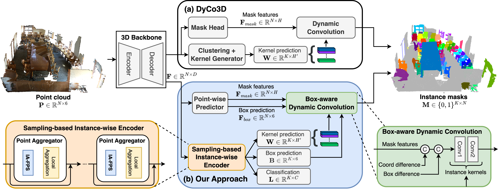

[](https://paperswithcode.com/sota/3d-instance-segmentation-on-scannetv2?p=isbnet-a-3d-point-cloud-instance-segmentation) 

[](https://paperswithcode.com/sota/3d-instance-segmentation-on-scannet200?p=isbnet-a-3d-point-cloud-instance-segmentation)

[](https://paperswithcode.com/sota/3d-instance-segmentation-on-s3dis?p=isbnet-a-3d-point-cloud-instance-segmentation)

[](https://paperswithcode.com/sota/3d-instance-segmentation-on-stpls3d?p=isbnet-a-3d-point-cloud-instance-segmentation)


##### Table of contents
1. [Features](#Features)
2. [Datasets](#Datasets)
3. [Installation](#Installation)
4. [Data Preparation](#Data-Preparation)
5. [Training and Testing](#Training-and-Testing) 
6. [Quick Demo](#Quick-Demo)
7. [Visualization](#Qualitative-Results)
8. [Acknowledgments](#Acknowledgments)
9. [Contacts](#Contacts)

# ISBNet: a 3D Point Cloud Instance Segmentation Network with Instance-aware Sampling and Box-aware Dynamic Convolution

<a href="https://arxiv.org/abs/2303.00246"></a>

[Tuan Duc Ngo](https://ngoductuanlhp.github.io/),
[Binh-Son Hua](https://sonhua.github.io/),
[Khoi Nguyen](https://www.khoinguyen.org/)<br>
VinAI Research, Vietnam

> **Abstract**: 
Existing 3D instance segmentation methods are predominant by a bottom-up design: a manually fine-tuned algorithm to group points into clusters followed by a refinement network. Relying on the quality of the clusters, these methods generate susceptible results when (1) nearby objects with the same semantic class are packed together, or (2) large objects with complex shapes. To address these shortcomings, we introduce ISBNet, a novel cluster-free method that represents instances as kernels and decodes instance masks via dynamic convolution. To efficiently generate a high-recall and discriminative kernel set, we propose a simple strategy, named Instance-aware Farthest Point Sampling, to sample candidates and leverage the point aggregation layer adopted from PointNet++ to encode candidate features. Moreover, we show that training 3D instance segmentation in a multi-task learning setting with an additional axis-aligned bounding box prediction head further boosts performance. Our method set new state-of-the-art results on ScanNetV2 (55.9), S3DIS (60.8), and STPLS3D (49.2) in terms of AP and retains fast inference time (237ms per scene on ScanNetV2).


Details of the model architecture and experimental results can be found in [our paper](https://arxiv.org/abs/2303.00246v2):

```bibtext
@inproceedings{ngo2023isbnet,
 author={Tuan Duc Ngo, Binh-Son Hua, Khoi Nguyen},
 booktitle={Proceedings of the IEEE/CVF Conference on Computer Vision and Pattern Recognition (CVPR)},
 title={ISBNet: a 3D Point Cloud Instance Segmentation Network with Instance-aware Sampling and Box-aware Dynamic Convolution},
 year= {2023}
}
```

**Please CITE** our paper whenever this repository is used to help produce published results or incorporated into other software.

## Features :mega:
* State-of-the-art performance on ScanNetV2, S3DIS, and STPLS3D.
* High speed of 237ms per scan on ScanNetV2 dataset.
* Reproducibility code for both ScanNetV2, S3DIS and STPLS3D datasets.

## Datasets :floppy_disk:

- [x] ScanNetV2
- [x] ScanNetV2-200
- [x] S3DIS
- [x] STPLS3D

## Installation :memo:
Please refer to [installation guide](docs/INSTALL.md).

## Data Preparation :hammer:
Please refer to [data preparation](dataset/README.md).

## Training and Testing :train2:
Please refer to [training guide](docs/TRAIN.md).

## Quick Demo :fire:

### [ScanNetv2](https://kaldir.vc.in.tum.de/scannet_benchmark/semantic_instance_3d?metric=ap)

| Dataset | AP | AP_50 | Config | Checkpoint
|:-:|:-:|:-:|:-:|:-:|
| ScanNet test | 55.9 | 76.3 | 
| ScanNet val (paper) | 54.5 | 73.1 |
| ScanNet val | 56.8 | 73.3 | [config](configs/scannetv2/isbnet_scannetv2.yaml) | [checkpoint](https://drive.google.com/file/d/19FYLM5SzcQSKYR4r9iChauf5cleoXC_H/view?usp=drive_link) 
| ScanNet val (lightweight) | 50.1 | 68.9 | [config](configs/scannetv2/isbnet_lightweight_scannetv2.yaml) | [checkpoint](https://drive.google.com/file/d/1MOp2dq1KrJiTQxeLSbvTZX60CiUvAqcK/view?usp=share_link) 

### [ScanNetv2-200](https://kaldir.vc.in.tum.de/scannet_benchmark/scannet200_semantic_instance_3d)

| Dataset | AP | AP_50 | Config | Checkpoint
|:-:|:-:|:-:|:-:|:-:|
| ScanNet200 val | 23.7 | 31.5 | [config](configs/scannet200/isbnet_scannet200.yaml) | [checkpoint](https://drive.google.com/file/d/1ZEZgQeT6dIakljSTx4s5YZM0n2rwC3Kw/view?usp=share_link) 


### [S3DIS](http://buildingparser.stanford.edu/dataset.html)

| Dataset | AP | AP_50 | Config | Checkpoint
|:-:|:-:|:-:|:-:|:-:|
| Area 5 | 56.3 | 67.5 | [config](configs/s3dis/isbnet_s3dis_area5.yaml) | [checkpoint](https://drive.google.com/file/d/1oup4nEdgsmdwnMP1TQPmoIqZ8c1RoTgA/view?usp=share_link) 

### [STPLS3D](https://www.stpls3d.com/)

| Dataset | AP | AP_50 | Config | Checkpoint
|:-:|:-:|:-:|:-:|:-:|
| STPLS3D val | 49.3 | 64.0 | [config](configs/stpls3d/isbnet_stpls3d.yaml) | [checkpoint](https://drive.google.com/file/d/1EhPsl4003Y9HEycdFP0nYpoleEpQ2faJ/view?usp=share_link) 


Run evaluation with pre-trained models:

```
python3 tools/test.py <path_to_config_file> <path_to_pretrain_weight>
```
## Visualization :computer:
Please refer to [visualization guide](visualization/README.md).
We provide the qualitative results of our method at [here](docs/QUALITATIVE.md)

## Acknowledgements :clap:
This repo is built upon [SpConv](https://github.com/traveller59/spconv), [DyCo3D](https://github.com/aim-uofa/DyCo3D), [SSTNet](https://github.com/Gorilla-Lab-SCUT/SSTNet), and [SoftGroup](https://github.com/thangvubk/SoftGroup). 

## Contacts :email:
If you have any questions or suggestions about this repo, please feel free to contact me (ductuan.ngo99@gmail.com).